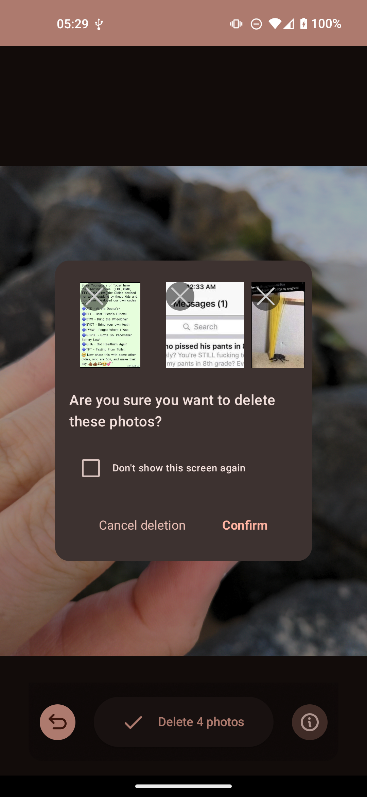

# PhotoSwooper

A dating app for ur photos <3

Have you ever had too many photos and would just love to swipe them like dating profiles?

Well I made just the app: PhotoSwooper :D

## Features

> Features last updated 2025-04-04

- [X] Undo button
- [X] Info drawer
- [X] Review photos to be deleted
- [ ] Statistics page ([WIP](https://codeberg.org/Loowiz/PhotoSwooper/src/branch/stats-screen))

## Screenshots

> Screenshots as of 2025-03-15

## Issues

If you would like to report a bug or request a feature, you may do so via the issues section of this git page or via
any contact method listed on [my website](https://loowiz.envs.net).

## Legal

Please read LICENSE file (idk what else to add here lol legal just sounds fancy so I wanted to add it)